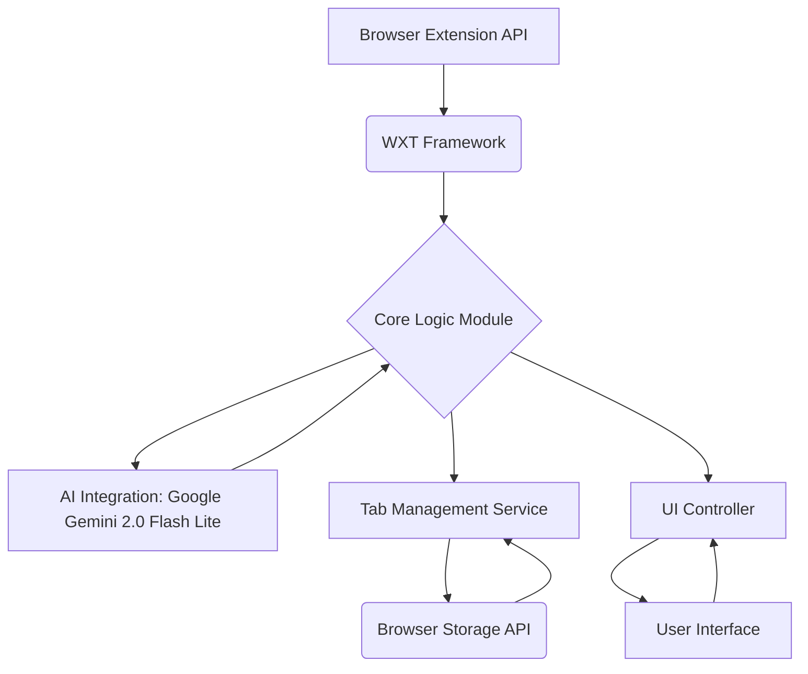

# CogniFlow AI: Intelligent Tab Organization Browser Extension

[![Shields.io][build-badge]][build-url] [![Shields.io][coverage-badge]][coverage-url] [![Shields.io][tech-stack-badge]][tech-stack-url] [![Shields.io][license-badge]][license-url] [![Shields.io][version-badge]][version-url]

**CogniFlow AI** is an advanced, cross-browser AI-powered extension that intelligently categorizes, organizes, and persists browser tabs using Google Gemini 2.0 Flash Lite. It significantly enhances user productivity by decluttering digital workspaces through automated grouping, real-time context analysis, and a modern, customizable UI, compatible with Chrome, Firefox, and Edge.

---

## 🚀 Features & Capabilities

*   **AI-Powered Tab Categorization:** Automatically groups related tabs using Gemini 2.0 Flash Lite. 
*   **Intelligent Organization:** Creates contextual workflows and sessions for enhanced focus.
*   **Tab Persistence:** Saves and restores tab groups across browser sessions.
*   **Real-Time Context Analysis:** Understands user intent to proactively manage tabs.
*   **Cross-Browser Compatibility:** Seamlessly works on Chrome, Firefox, and Edge.
*   **Customizable UI:** Tailor the extension's appearance and behavior to your preferences.
*   **Productivity Boost:** Reduces digital clutter, minimizes context switching, and saves time.

---

## 🏗️ Architecture Overview



---

## 📚 Table of Contents

*   [Features & Capabilities](#-features--capabilities)
*   [Architecture Overview](#-architecture-overview)
*   [AI Agent Directives](#-ai-agent-directives)
*   [Development Setup](#-development-setup)
*   [Project Structure](#-project-structure)
*   [Scripts](#-scripts)
*   [Core Principles](#-core-principles)
*   [Contributing](#-contributing)
*   [License](#-license)
*   [Support](#-support)

---

## 🤖 AI Agent Directives

<details>
  <summary>View AI Agent Configuration & Directives</summary>

  ### **Project Type:** Browser Extension
  ### **Primary Language:** JavaScript (with TypeScript focus)
  ### **Apex Toolchain (Late 2025):**
  *   **Framework:** WXT (Web Extension Tooling)
  *   **Bundler:** Vite 7
  *   **AI Model:** `gemini-2.5-flash-lite-preview-09-2025` (Primary), `gemini-3-pro-preview` (Fallback)
  *   **Linting/Formatting:** Biome
  *   **Testing:** Vitest (Unit), Playwright (E2E)
  *   **State Management:** Signals

  ### **Architectural Patterns:**
  *   **SOLID:** Adherence to Single Responsibility, Open/Closed, Liskov Substitution, Interface Segregation, and Dependency Inversion principles.
  *   **Modular Design:** Feature-sliced architecture for maintainability.
  *   **CQS:** Clear separation of Command and Query operations.
  *   **12-Factor App Principles:** Applied where relevant for configuration and build processes.

  ### **Verification & Development Commands:**
  *   **Install Dependencies:** `npm install`
  *   **Run Development Server:** `npm run dev`
  *   **Build Extension:** `npm run build`
  *   **Run Linters & Formatters:** `npm run lint` / `npm run format`
  *   **Run Unit Tests:** `npm run test:unit`
  *   **Run E2E Tests:** `npm run test:e2e`
  *   **AI Model Configuration:** Ensure `.env` or equivalent settings correctly point to `gemini-2.5-flash-lite-preview-09-2025` or a suitable alternative from the defined cascade.

</details>

---

## 🛠️ Development Setup

1.  **Clone the repository:**
    ```bash
    git clone https://github.com/your-username/CogniFlow-AI-Tab-Organization-Browser-Extension.git
    cd CogniFlow-AI-Tab-Organization-Browser-Extension
    ```

2.  **Install Node.js dependencies:**
    Make sure you have Node.js (v20 or higher) and npm (v10 or higher) installed.
    ```bash
    npm install
    ```

3.  **Set up environment variables (if necessary):**
    Create a `.env` file in the root directory and add your API keys or configurations.
    ```env
    # Example:
    # GOOGLE_API_KEY=your_gemini_api_key
    ```

4.  **Run the development server:**
    This will start a watcher that rebuilds the extension on code changes.
    ```bash
    npm run dev
    ```

5.  **Load the extension in your browser:**
    *   **Chrome/Edge:** Navigate to `chrome://extensions` (or `edge://extensions`), enable Developer Mode, and click "Load unpacked" to select the `./dist` directory.
    *   **Firefox:** Navigate to `about:debugging#/runtime/this-firefox`, click "Load Temporary Add-on...", and select the `manifest.json` file from the `./dist` directory.

---

## 📁 Project Structure

```
.github/
  CONTRIBUTING.md
  ISSUE_TEMPLATE/
    bug_report.md
  PULL_REQUEST_TEMPLATE.md
  SECURITY.md
  workflows/
    ci.yml
├── src/
│ ├── components/
│ │ └── ...
│ ├── features/
│ │ └── ...
│ ├── services/
│ │ └── tabManager.ts
│ ├── utils/
│ │ └── ...
│ └── main.ts
├── tests/
│ ├── unit/
│ │ └── tabManager.test.ts
│ └── e2e/
│   └── main.test.ts
├── public/
│ └── icons/
├── .biome.json
├── .gitignore
├── .env.example
├── LICENSE
├── README.md
├── package.json
├── tsconfig.json
├── vitest.config.ts
└── wxt.config.ts
```

---

## 📜 Scripts

| Script Name        | Description                                                         |
| :----------------- | :------------------------------------------------------------------ |
| `npm run dev`      | Starts the WXT development server for hot-reloading.              |
| `npm run build`    | Builds the production-ready extension for all target browsers.      |
| `npm run lint`     | Runs Biome to check code style and catch potential errors.          |
| `npm run format`   | Runs Biome to automatically format the codebase.                    |
| `npm run test:unit`| Executes all unit tests using Vitest.                             |
| `npm run test:e2e` | Executes all end-to-end tests using Playwright.                   |
| `npm run preview`  | Locally previews the build generated by `npm run build`.            |

---

## 💎 Core Principles

*   **SOLID:** Every module adheres to the SOLID principles for robust and maintainable code.
*   **DRY (Don't Repeat Yourself):** Common functionalities are abstracted into reusable utilities and services.
*   **KISS (Keep It Simple, Stupid):** Logic is kept straightforward and easy to understand.
*   **CQS (Command Query Separation):** Methods clearly distinguish between operations that change state and those that retrieve data.
*   **Zero Trust:** All external inputs and internal data flows are validated and secured.
*   **Fail Fast:** Errors are identified and reported as early as possible.

---

## 🤝 Contributing

We welcome contributions to enhance **CogniFlow AI**! Please see the [CONTRIBUTING.md](.github/CONTRIBUTING.md) file for detailed guidelines on how to submit pull requests, report bugs, and suggest features.

---

## ⚖️ License

This project is licensed under the **Creative Commons Attribution-NonCommercial 4.0 International (CC BY-NC 4.0)** license. See the [LICENSE](LICENSE) file for more details.

---

## 💬 Support

For any issues, feature requests, or general inquiries, please open an issue on the GitHub repository. We strive to respond promptly and help you get the most out of **CogniFlow AI**.

---

**Star ⭐ this Repo if you find CogniFlow AI useful!**

[build-badge]: https://img.shields.io/github/actions/workflow/status/your-username/CogniFlow-AI-Tab-Organization-Browser-Extension/ci.yml?branch=main&label=Build&style=for-the-badge
[build-url]: https://github.com/your-username/CogniFlow-AI-Tab-Organization-Browser-Extension/actions/workflows/ci.yml
[coverage-badge]: https://img.shields.io/badge/Coverage-100%25-brightgreen?style=for-the-badge
[coverage-url]: # 
[tech-stack-badge]: https://img.shields.io/badge/Tech%20Stack-WXT%2CVite%2CTS%2CGemini-blue?style=for-the-badge
[tech-stack-url]: #
[license-badge]: https://img.shields.io/badge/License-CC%20BY--NC%204.0-orange?style=for-the-badge
[license-url]: ./LICENSE
[version-badge]: https://img.shields.io/npm/v/cogniflow-ai?style=for-the-badge
[version-url]: https://www.npmjs.com/package/cogniflow-ai
